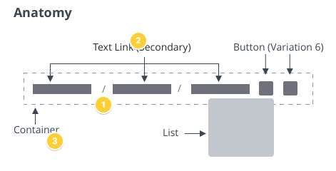

# ptcs-breadcrumb

## Visual



## Overview
A Breadcrumb control shows the current location of the user. It provides a sequence of links to other locations or states.

You can show previously visited locations, or the current location of a user within a website hierarchy.


## Usage Examples

### Basic Usage

In the example, _path_ is an array of strings. 

`<ptcs-breadcrumb items="[[path]]"></ptcs-breadcrumb>
`

You can set it using a Polymer data binding, or manually by assigning the property using JavaScript code.


The following code block shows setting up an event listener to navigate using the breadcrumb:

```
document.getElementById(...).addEventListener('ptcs-breadcrumb', ev =>
{
    console.log("Goto step " + ev.detail.index);
});
```


## Component API

### Properties
| Property | Type | Description |
|----------|------|-------------|
|items | Array | An array of strings, where each string is a step in the breadcrumb path. |
|disabled|Boolean| Disables the breadcrumb |
|selector|String| The selector is the key that specifies the entry label when _items_ is a list of objects, |
|selectorUrl|String|If items is an array of objects, the selecturUrl should hold the key to the URL to use for each entry|
|showCurrentLevel|Boolean|Should the "current" breadcrumb level be shown or not?|
|linkTruncation|Boolean| Truncates long links |
|linkTruncationLength|Number| The maximum width of each length when truncated|
|leftButtonIcon|String| The filename of the icon to use for the left button|
|rightButtonIcon|String| The filename of the icon to use for the right button|

### Events

| Name | Data | Description |
|------|------|-------------|
| ptcs-breadcrumb | ev.detail = { index, item } | Generated when the user clicks on a step in the breadcrumb path. _index_ is the index into the path and _item_ is the item (the step string)|


## Styling

### The Parts of a Breadcrumb

| Part | Description |
|-----------|-------------|
|root|A ptcs-hbar serving as the root of the component|
|leftbutton| A ptcs-button to scroll the list to the left|
|body|A ptcs-hbar that contains the list of breadcrumbs and separators|
|link|A ptcs-link breadcrumb entry|
|separator| A ptcs-label that contains the '/' that separates the crumbs
|rightbutton|A ptcs-button to scroll the list to the right|
|dropdown|A ptcs-dropdown list that contains a quick-pick dropdown list of all breadcrumb items|


## ARIA

To be determined

## TODO
- Keyboard navigation
- HTML dir attribute
- ARIA attributes (?)
- Support MS File Explorer feature, where each step separator is clickable and allows user to select any substep (?)
- Allow breadcrumb content to consist of arbitrarily complex markup (?)
