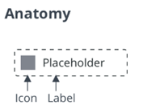

# ptcs-button

## Visual

## Overview

A button can be _activated_ through a click, a screen touch, or a key press.
When a button is _activated_, any actions that are connected to the button are performed. A _disabled_ button cannot be activated.

## Usage Examples

### Basic Usage

~~~html
    <ptcs-button onclick="ok()" label="Ok"></ptcs-button>
    <ptcs-button variant="secondary" onclick="edit()" label="Edit"></ptcs-button>
    <ptcs-button variant="tertiary" onclick="cancel()" label="Cancel"></ptcs-button>
~~~

~~~javascript
    function ok()
    {
      console.log("Clicked on Ok");
    }

    function edit()
    {
      console.log("Clicked on Edit");
    }

    function cancel()
    {
      console.log("Clicked on Cancel");
    }
~~~

### Button with icon

~~~html
    <ptcs-button icon="delete" label="Delete"></ptcs-button2>
 ~~~

## Component API

### Properties
| Property | Type | Description | Triggers a changed event? |
|----------|------|-------------|---------------------------|
| buttonMaxWidth | Number | The maximum width of the button in pixels | No |
| contentAlign | String | The alignment of the label. Set to "center" by default | No |
| disabled | Boolean | Disables the button | No |
| icon | String | The path to the .png button icon | No |
| iconSrc | String | The path to the .svg button icon | No |
| label | String | The button label | No |
| mode | String | The mode of the button. Default: "label" | No |
| tooltip | String | The tooltip that appears when hovering over the button | No |
| tooltipIcon | String | The icon for the tooltip | No |
| variant | String | Specifies style variant of the button. Set to "Primary" by default | Yes |

### Events

| Name | Data | Description |
|------|------|-------------|
| click | standard | A Standard DOM event for mouse clicks (until a general activation event is available that also support keyboard activation) |

### Methods

The button has no methods

## Styling

### Parts

| Part | Description |
|-----------|-------------|
|root|The button parent element|
|icon| The button icon|
|label| The button label|

### States
| Attribute    | Description                                      | Part                 |
|--------------|--------------------------------------------------|----------------------|
| variant      | Specifies the variant                            | :host                |
| icon         | The path to the PNG icon                                  | :host                |
| iconSrc      | The path to SVG icon                                   | :host                |
| hidden       | Hides the part                                  | icon, label, tooltip |
| contentAlign | The alignment of the label and the icon              | :host                |
| src          | The icon path (SVG)                                  | icon                 |
| mode         | Does the button contain a label, an icon or both | :host                |
| disabled     | Disables the part                                | :host                |
|

## TODO

- special event for _activation_
- special event for _focus_
- special event for _blur_
- special event for _disable_ state change
- support for key bindings (?)
- bind function / variable to button, so activation can be handled without events(?)
