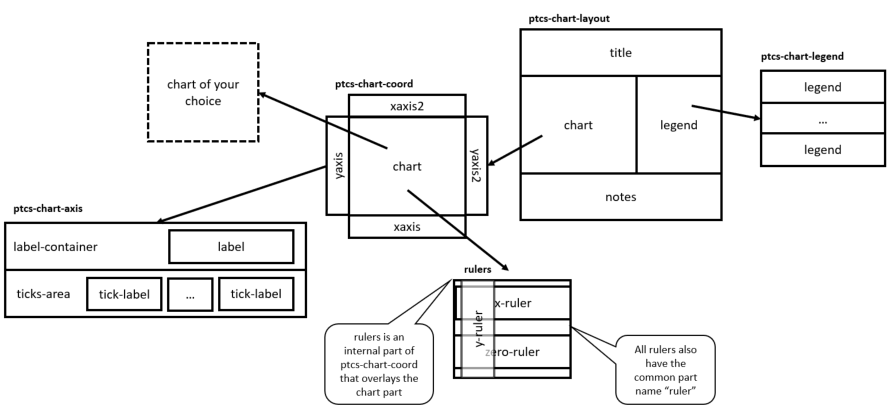

# ptcs-chart

## Overview

`ptcs-chart` is a component ecosystem that together implements data visualisation / charting.

The ecosystem consists of three parts:

- _Common components_, for common tasks that can be used by all components
- _Core components_, for components that implements the core functionality of a specific chart type - or types
- _Compound components_, for components that combines common and core components into a single component, for convenient usage.

The user can either use a single compound component, if it supports the requirements, or manually combine common and core components for more advanced needs.

### The charting ecosystem

### Common components

- [ptcs-chart-layout](./doc/ptcs-chart-layout.md), for chart layouts
- [ptcs-chart-legend](./doc/ptcs-chart-legend.md), for chart legend
- [ptcs-chart-coord](./doc/ptcs-chart-coord.md), for combining a chart with a coordinate system (adds axes and rulers)
- [ptcs-chart-axis](./doc/ptcs-chart-axis.md), for chart axes

### Core components
- [ptcs-chart-core-bar](./doc/ptcs-chart-core-bar.md), a _bar chart_ component
- [ptcs-chart-line-bar](./doc/ptcs-chart-core-bar.md), a _line chart_ coponent, that also implements _area charts_, _scatter plots_ and _streamgraphs_

### Compound components
- [ptcs-chart-bar](./doc/ptcs-chart-bar.md), a complete _bar chart_, with a _layout_, a _coordinate system_ and an _x-_ and _y-axis_
- [ptcs-chart-line](./doc/ptcs-chart-line.md), a complete _line chart_, _area chart_, _scatter plot_ and _streamgraph_
