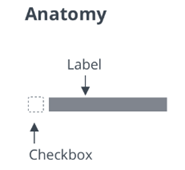

# ptcs-checkbox

## Visual

## Overview

A checkbox can be in an _on_ or an _off_ state. Selecting or clearing the checkbox toggles a state.
The checkbox behaves according to the functionality of the ptcs-behavior-binary/ptcs-behavior-binary.html.

## Usage Examples

### Basic Usage

    <ptcs-checkbox variable="{{show}}">Show</ptcs-checkbox>

Sets the _show_ variable to _true_ when the checkbox state is _on_, and to _false_ when it is _off_.

### Start in an on state (checked)

    <ptcs-checkbox variable="{{show}}" checked>Show</ptcs-checkbox>

### Explicit variable values

    <ptcs-checkbox variable="{{tool}}" value-on="knife" value-off="fork">Use tool</ptcs-checkbox>

Sets the _tool_ variable to "knife" when the checkbox is set to _on_ and "fork" when it is set to _off_.

## Component API

### Properties
| Property | Type | Description | Triggers a changed event |
|----------|------|-------------|--------------------------|
|checked| Boolean | The current state of the checkbox (on: checked = true, off: checked = false) | No |
|disabled| Boolean | Use this property to disable the checkbox | No |
|label| String | Specifies the checkbox label | No |
|maxWidth| String | Sets the maximum width of the label | No |
|partial| Boolean | Displays a dash instead of a check mark | No |
|tooltip | String | The tooltip that appears when hovering over the checkbox | No |
|tooltipIcon | String | The icon for the tooltip | No |
|variable| _any_ | Sets the variable name that the checkbox monitors and assigns| No |
|valueOff| _any_ | Sets the value that the checkbox assigns to _variable_ when the checkbox is _off_. Set to _false_ by default | No |
|valueOn| _any_ | Sets the value that the checkbox assigns to _variable_ when the checkbox is _on_. Set to _true_ by default. | No |

### Methods

No methods

## Styling

### The Parts of a Component

| Part | Description |
|------|-------------|
| root | The button container |
| box | The container for the box that contains the marker |
| check-mark | The check mark of the box element |
| label | The container for the text label |

### State attributes

| Attribute | Description | Part |
|-----------|-------------|------|
| checked | Current state (on: checked = true, off: checked = false) | :host |
| disabled | Indicates whether the checkbox is disabled | :host |
| label | The displayed label | :host, label |
| partial | Shows a dash instead of a check mark | :host |
