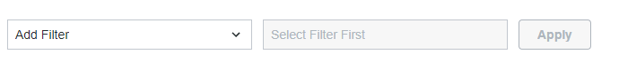
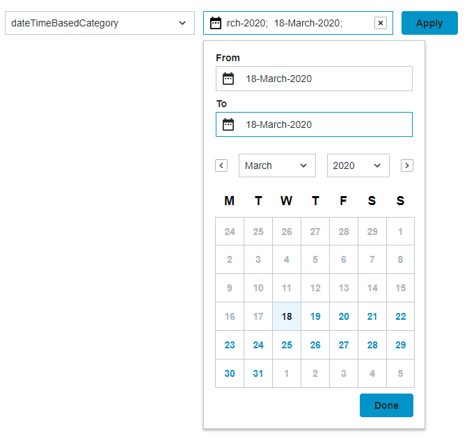
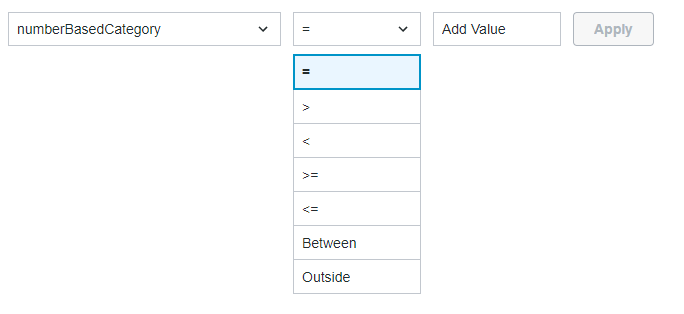
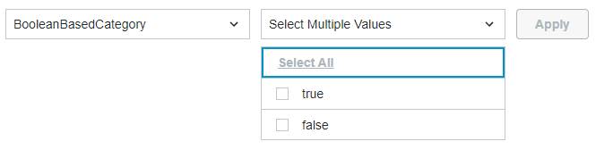

# ptcs-chip-data-filter

### Visual

### string-case

### datetime-case

### number-case

### boolean-case

## Overview

Filter Data widget is intended for data filtering. The filter options are listed in the drop down on the left side based on 'data' input parameter. "DataShape"->"fielDefinition" field is taken into account to extract the supported filter categories.

## Usage Examples

### Basic Usage

#### HTML
~~~html
    <ptcs-chip-data-filter id="dataFilterId"></ptcs-chip-data-filter>
~~~

### Pure JS
~~~javascript
    let ptcsDataFilter = document.querySelector("dataFilterId");
    if (ptcsDataFilter) {
        ptcsDataFilter.addEventListener("change", event => {
            console.log(ptcsDataFilter.query);
        });
        ptcsDataFilter.data = [
            dataShape: {
                fieldDefinitions: {
                    TextBasedCategory: {
                        name:        'textBasedCategory',
                        description: 'audit message text',
                        baseType:    'STRING',
                        ordinal:     3,
                        aspects:     {}
                    },
                    DateTimeBasedCategory: {
                        name:        'dateTimeBasedCategory',
                        description: '',
                        baseType:    'DATETIME',
                        ordinal:     1,
                        aspects:     {}
                    }
                }
            }
        ];
    }
~~~

### Polymer code
~~~javascript
    static get template() {
        return html`
            <ptcs-chip-data-filter query={{query}} on-change="__handleDataFilterChange" id="dataFilter"></ptcs-chip-data-filter>
        `;
    }
~~~

## Component API

### Properties
| Property     | Type   | Description                                                                                    | Triggers a changed event? |
|--------------|--------|------------------------------------------------------------------------------------------------|---------------------------|
| data         | Object | Describes filter options                                                                       | No                        |
| query        | String | Read only, describes query in JSON format, filter options                                      | No                        |
| daysContainingAnyData | Array [Date type] | Add dots the calendar on the appropriate days                              | No                        |

TBD

### Events

| Name | Data | Description |
|------|------|-------------|
| query-changed| { value: Object } | The generated data in JSON format  |

### Methods
TBD

## Styling

### Parts

| Part | Description |
|-----------|-------------|
| selector | The container of all dropdowns|
| chip-container | The contain nd elements in chips |

### States
| Attribute    | Description                                      | Part                 |
|--------------|--------------------------------------------------|----------------------|
TBD
