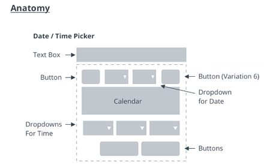
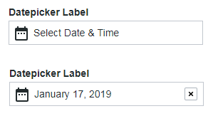
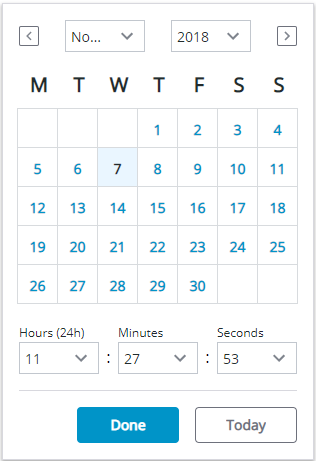
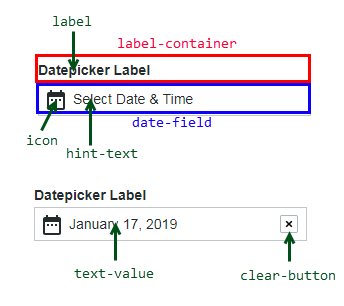
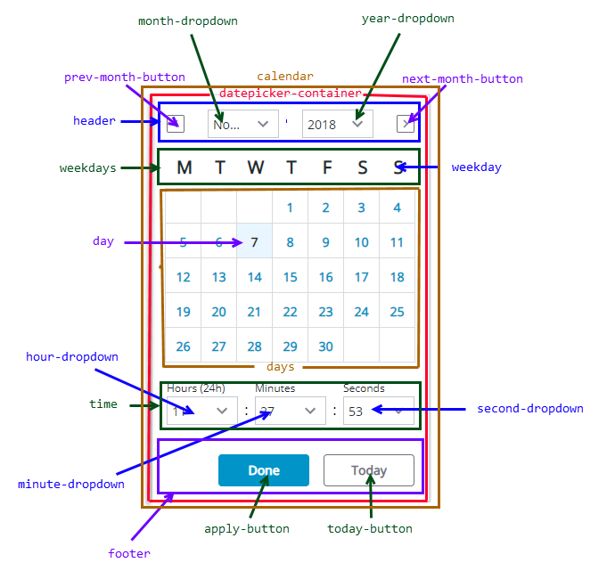

# ptcs-datepicker

## Visual

### Closed

### Opened

## Overview

The date picker is a dialog box that enables you to pick a specific date and time. The date can be displayed according to a format that is specified by the user.

The date picker is implemented with the [momentjs library](https://momentjs.com) and it uses its format specification.

## Usage Examples

### Basic Usage

~~~html
<ptcs-datepicker></ptcs-datepicker>
~~~

### Specific date and format selected

~~~html
 <ptcs-datepicker format="LL" date="2018-11-25"></ptcs-datepicker>
~~~

In the  example above, the attributes indicate:
- date - The date to display
- format - The date format specifier according to the momentjs format. The 'LL' value generates the following: 'November 25, 2018'.

~~~html
<ptcs-datepicker week-start="day" month-format="YMD" date-order="order" action-position="location" show-time display-seconds></ptcs-datepicker>
~~~

In the above example substitute attribute *values*:
- _day_ - possible values: Monday, Sunday
- _YMD_ - possible values: full, short, numeric
- _order_ - possible values: YMD, MDY, DMY
- _location_ - possible values: left, right

### Date range selection selected
~~~html
 <ptcs-datepicker date-range-selection></ptcs-datepicker>
~~~

In the above example, datepicker allows to select range of date

## Component API

### Properties

| Property | Type | Description | Triggers a changed event? |
|----------|------|-------------|---------------------------|
| actionPosition | String | Sets the position of the "Done" button. The allowed values are "left" and "right". When set to "left", the button is placed to the left of the "Today" button. | No |
| date | String | Opens the calendar on a specific date using the following format: YYYY-MM-DD | Yes |
| dateDelimiter | String | The separator to use between date components. Set to '-' by default. | No |
| dateOnly | Boolean | A property for the _dateFormat call | No |
| dateOrder | String | The order of the year, month, and day. You can set it to "auto", "YMD", "MDY", or "DMY". Setting it to "auto" defaults to the "YMD" format. | No |
| dateTime | Date | The actual data, as a Date object | Yes |
| disabled | Boolean | Disables the date picker | No |
| displaySeconds | Boolean | Displays seconds as part of the date. | No |
| formatToken | String |  Overrides the format of the displayed date. See the [Available formats](https://momentjs.com/docs/#/displaying/format/).| No |
| hidden | Boolean | Hides the calendar | No |
| hintText | String | Sets the prompt text to pick a date | No |
| initWithCurrentDateTime | Boolean | Initializes the date picker with current date and time. | No |
| interval | Number | The refresh rate for updating the calendar. Default: 0 | No |
| intervalType | String | The unit of refresh rate for updating the calendar. Default: 'h'. Allowed values: 'h' - Hours, 'm' - Minutes, 's' - Seconds, 'd' - Days | No |
| label | String | An optional label above the date picker  | No |
| monthFormat | String | The month format. Allowed values: "full", "short", "numeric" (default: "full") | No |
| labelAlignment | String | The horizontal alignment of the label. Allowed values: "left", "center", "right" (default: "left") | No |
| selectedDate | Object | The selected date as a moment object | Yes |
| showTime | Boolean | Shows the time in the picker. (default: false) | No |
|tooltip | String | The tooltip that appears when hovering over the date picker | No |
|tooltipIcon | String | The icon for the tooltip | No |
| weekStart | String | The first day of the week. Set to "Monday" by default. The allowed values are "Monday" and "Sunday". | No |
| dateRangeSelection | Boolean | Enables you to specify a date range by selecting a start and an end date. You cannot specify a time value when range selection is enabled. (default: true) | No |
| showTodayButton | Boolean | Adds a button that enables you to select the current date. (default: false) | No |
| fromDate | Date | A bindable property that sets the value of the start date for the date range. The value must be smaller than or equal to the toDate. | Yes |
| toDate | Date | A bindable property that sets the value of the end date for the date range. The value must be larger than or equal to the fromDate. | Yes |
| fromFieldLabel | String | Specifies the label to display for the start date field | No |
| toFieldLabel | String | Specifies the label to display for the end date field. | No |
| fromAndToFieldsHintText | String | Specifies the hint text to display within the start and end date fields.| No |

Additional  properties **chip-data-filter only**:
| multipleDateSelection | Boolean | An option that allows you to select several days or several date ranges in the datepicker. | No |
| daysContainingAnyData | Array (timestamp) | Displays dots on days that generated any data. | No |
| listOfSelectedDates | Array | The list containing selected days or date ranges (Only when multipleDateSelection selected) | No |

### Events

| Name | Data | Description |
|------|------|-------------|
| calendar-date-changed| { value: date } | The generated date as a string in specified format  |
|                      | { value: closeCalendar} | Boolean  |

### States

| Attribute | Description | Part |
|-----------|-------------|------|
|date| The actual date data | :host, date-field |
|disabled| Date picker or calendar state | :host, date-field, calendar |
|hidden| Indicates whether the date picker calendar is open. | calendar |
|label| The date picker label | :host, label |
|label-alignment| The horizontal alignment of the label | :host |
|no-label| Is True when there is no label| label|

### Methods

## Styling

### Parts

The **closed** date time picker is a text field with a calendar icon. In the text field, you can specify hint text or display the date and time. A clear button is appears when the picker displays the date and time.

Note: The date picker has an optional label.

| Part | Description |
|-----------|-------------|
| label-container | The container panel of the label above the date picker |
| label | The label above the date picker |
| date-field | The container for the current timestamp or hint text|
| date-field-label | **chip-data-filter only** The container for currently selected dates or range of dates (timestamp) as chips, or hint text|
| icon | The calendar icon |
| hint-text | The text prompt that is displayed to select a date and time |
| text-value | The generated date and time in specified format |
| clear-button | The button to clear a generated date and time string, reverting the contents to the hint text |

The **opened** date time picker displays date and time selectors with the following parts:

| Part | Description |
|-----------|-------------|
|calendar| The container panel of the calendar drop-down in the date picker|
|datepicker-container| The calendar container panel|
|header| The top part of the date picker, with navigation button for previous month, month dropdown, year dropdown, and navigation button for next month |
|prev-month-button| The back arrow|
|month-dropdown| The month drop-down selector |
|year-dropdown| The year drop-down selector |
|next-month-button| The forward arrow|
|weekdays| The weekdays container panel|
|weekday| A single weekday|
|days| The day date container panel|
|day| A single day|
|time| The time selector container |
|hour-dropdown| The hours drop-down selector|
|minute-dropdown| The minutes drop-down selector|
|second-dropdown| The seconds drop-down selector|
|footer| The lower panel container for the buttons Done and Today|
|apply-button| The Done button|
|today-button| The Today button |

Additional  parts with **date-range-selection** option selected:

| range-inputs | The container for the current timestamp or hint text |
| date-field-from | The container for the current 'from' timestamp |
| date-field-to | The container for the current 'to' timestamp |

Additional  part **chip-data-filter only** when **days-containing-any-data** has any data:
| dot | A dot informing that any data has been generated in a specific day |

