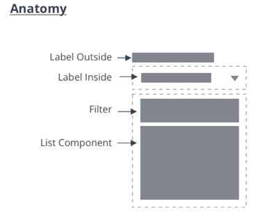
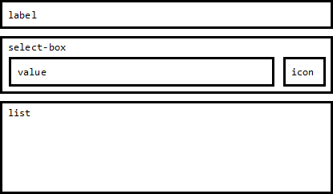

# ptcs-dropdown
## Visual

## Anatomy

## Overview

The Dropdown allows the user to select from a list of choices. The selection can be a single item or multiple items. The list of items is only visible when the user interacts with the dropdown.

## Usage Examples

### Basic Usage

~~~html
<ptcs-dropdown items="[[options]]"></ptcs-dropdown>
~~~

### Multi select dropdown

~~~html
<ptcs-dropdown items="[[options]]" multi-select></ptcs-dropdown>
~~~

## Component API

### Properties
| Property | Type | Description |  Triggers a changed event? |
|--------- |------|-------------|----------------------------|
| alignment | String | Alignment of the selected value and of the items in the drop-down list |
| autoSelectFirstRow | Boolean | Automatic select first item when items list is changed (true). No pre-defined selection otherwise |
| clearSelectionItem | Boolean | Toggle to display an item to clear a selection in single selection list |
| clearSelectionLabel | String | The custom text to display in the item to clear a selection in single selection list |
| disabled | Boolean | Is the drop-down disabled? |
| displayMode | String | When displayMode is set to "default", a drop-down icon is displayed in the select box. When displayMode is set to "small", a small ptcs-button is displayed. |
| hintText | String | The text to display in the selected value box when no item is selected. Note: This value is inherited by the drop-down list as its hintText property. It is also used as the label for the "reset selection" option. |
| initialCount | Number | A number that specifies the number of items to generate when the data changes. The items are loaded in chunks, and the list only generates a specific number of items. The remaining items are created and rendered incrementally at each animation frame, in initialCount chunks, until all instances have been rendered. This makes the application more responsive, but it may cause the user to wait for the list to be built. |
| itemMeta | Object | Consists of three parts: _itemMeta.type_ is one of "text" (default), "link", "image", or "checkbox". The value specifies whether the selected value and list items are a label, link, image, or a checkbox. When it is a link, the link label is specified by _itemMeta.label_ and the target by _itemMeta.target_. The item value is used as the href of the link |
| items | Array | A JavaScript array with the drop-down data |
| label | String | An optional label above the drop down |
| labelAlignment | String | The label alignment. You can set it to "left" (default), "center", or "right". |
| metaSelector | Any | The same as _selector_ but selects the meta string instead. If _metaSelector_ is "falsy", the meta string is not displayed|
| multiLine | Boolean | Displays items in the list across multiple lines. When disabled, each item is limited to a single line. |
| multiSelect | Boolean | Enables multiple selection mode. Set to _false_ by default. |
| rowHeight  | String |  Sets the minimum height of the list items in the drop-down list. The default value is '34' |
| selected |Number | Contains the index of the selected item when selectMode is set to "single".|
| selectedIndexes | Array | An array with the indexes of the selected items | yes |
| selectedItems | Array | An array with the selected items | yes |
| selectedValue |Object | Contains the value of the (according to _valueSelector_) selected item when selectMode is set to "single".| yes |
| selector | Any | Selects a string from each item in _items_ to be displayed as the drop-down item label. If _unassigned_, items should be an array of strings. If a _string_, then items is an array of objects, where selector specifies the (string) property to display. If a _function_, then the function is called for each item and should return a string that represents the item. |
| treatValueAsString | Boolean | Returns _selectedValue_ as _string_ when set to true and returns the original object when set to false. |
| valueHide | Boolean | Hides the selected value field. For example, you can enable the property to only show the drop-down icon. Set to _false_ by default. |
| valueSelector | Any | Selects a string from each item in _items_ to be displayed as the drop-down item value. If _unassigned_, uses _selector_ instead. If a _string_, then items is an array of objects, where valueSelector specifies the (string) property to display. If a _function_, then the function is called for each item, and should return a string that represents the item. |

### Methods

No methods

## Styling

### The Parts of a Component

| Part | Description |
|-----------|-------------|
|label|The dropdown label|
|select-box|The container that contains the selected value and the dropdown icon / button|
|value|The selected value|
|icon|The dropdown icon. This part only exists if displayMode="default"|
|list|The dropdown list|

### State attributes

| Attribute | Description | Part |
|-----------|-------------|------|
| closed | Is the dropdown list closed (hidden) | :host |
| disabled | Is the dropdown disabled | :host |
| open | Is the dropdown list is open (visible) | :host |
| hidden | Is the dropdown label hidden? | label |
| display-mode | see property displayMode | select-box |
| hidden | Is the dropdown value hidden ?| value |
