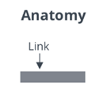

# ptc-link

## Visual

## Overview

A ptcs-link is a link that is similar to the HTML &lt;a&gt; element, with specific styling.

## Usage Examples

### Basic Usage

~~~html
<ptcs-link href="http://www.ptc.com" label="PTC"></ptcs-link>
~~~

## Component API

### Properties
| Property | Type | Description | Triggers a changed event |
|----------|------|-------------|--------------------------|
| alignment | String | Controls the alignment of items. You can set it to "left", "right", or "center". The default is "left" | No |
| disabled | Boolean | Disables the link | No |
| singleLine | Boolean | Shows the link text on a single line. Set to false by default. | No |
| href | String | Specifies the URL to open when the link is clicked | No |
| label | String | The link label | No |
| target | String | Target tab type: "new", "same" or "popup". Default: "same" | No |
| textMaximumWidth | String | The maximum width for the link text | No |
| tooltip | String | The tooltip that appears when hovering over the link | No |
| tooltipIcon | String | The icon for the tooltip | No |
| variant | String | The link variant. You can set the link type to "primary" or "secondary". The default is "primary" | No |

### Methods

No methods

## Styling

### The Parts of a Component

| Part | Description |
|-----------|-------------|
|link|The link element|
|label|The container for the label|

### State Attributes

| Attribute | Description | Part |
|-----------|-------------|------|
| disabled | Disables the link | :host, link |
| variant | Specifies the variant. You can set the link type to "primary" or "secondary". The default is "primary"  | :host |
