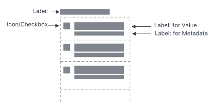

# ptc-list

## Visual

## Overview

A ptcs-list displays a list. Each list item can have a main "value label" and an optional "meta label" that is displayed below the value. The list supports both single and multiple selection mode. You can filter the list items.

## Usage Examples

### Basic Usage

~~~html
<ptcs-list items="[[items]]"></ptcs-list>
~~~

### Multi selection list

~~~html
<ptcs-list select-mode="multiple" items="[[items]]"></ptcs-list>
~~~

### List using a filter

~~~html
<ptcs-list filter items="[[items]]"></ptcs-list>
~~~

## Component API

### Properties
| Property | Type | Description |
|--------- |------|-------------|
| alignment | String | Controls the alignment of items within the list. You can set it to 'right', 'left', or 'center'. Set to 'left' by default. |
| allowNoItemSelection | Boolean | Disables or enables the clear selection button for single items |
| autoSelectFirstRow | Boolean | Automatic select first item when items list is changed (true). No pre-defined selection otherwise |
| clearSelectionLabel | String | The text to show in the item used to clear selection in single selection mode (when `allowNoItemSelection` is true)|
| disabled | Boolean | Disables the list |
| filter | Boolean | Displays a text-field box that filters the list |
| hintText | String | The text for the "clear selection" label in single selection mode |
| initialCount | Number | Defines an initial count of list items to render after setting the items array.  The remaining items are created and rendered incrementally at each animation frame until all instances have been rendered.  |
| itemMeta | Object | Determines the item type. You can set it to text, link, image, and checkbox. |
| items    | Array | A JavaScript array that contains the list data|
| label | String | An optional label that appears above the list |
| labelAlignment | String | Controls the alignment of items within the list. You can set it to 'right', 'left', or 'center'. Set to 'left' by default. |
| labelType | String | A variant to use for the list label. Default is 'label'. You can set it to 'header', 'sub-header', and 'body'.|
| metaSelector | Any | The same as _selector_ but selects the meta string instead. If _metaSelector_ has false data, the meta string is not displayed. |
| multiLine | Boolean | Determines whether list items can be displayed across multiple lines. |
| multiSelect | Boolean | Enables multiple item selection |
| rowHeight | String | Sets the row height |
| selected |Number | If selectMode = "single" then _selected_ contains the selected item, if any.|
| selectedIndexes | Array | An array with the indexes of the selected items |
| selectedItems | Array | An array with the selected items |
| selectedValue |Object | If selectMode = "single" then _selectedValue_ contains the selected item's value (according to _valueSelector_), if any.|
| selector | Any | Selects a string from each item in _items_ to be displayed as the list item label. If _unassigned_, items should be an array of strings. If a _string_ then items should be an array of objects, where the selector specifies the (string) property to display. If a _function_, then the function is called with each item and should return a string that represents the item. |
| treatValueAsString | Boolean | Returns _selectedValue_ as a _string_. Disabling the property returns the original object. |
| valueSelector | Any | Selects a string from each item in _items_ to display as the list item value. If _unassigned_, uses _selector_ instead. If a _string_ then items should be an array of objects, where selector specifies the (string) property to display. If a _function_, then the function is called with each item and should return a string that represents the item. |

### Events

| Name | Data | Description |
|------|------|-------------|
| DoubleClicked | { index of clicked item }  | Triggered whenever double-click event occurs on any item |

### Methods

No methods

## Styling

### Parts

| Part | Description |
|------|-------------|
| root | The container for list |
| label| An optional list label above the list |
| list-container | The list body container (everything but the label) |
| filter | The filter text-field |
| filter-field | The filter text-field |
| multi-select | the container for the link control that allows the whole list to be selected or unselected in multi-select mode |
| link | The select or un-select all link |
| list-item | A list item in the list |
| item-checkbox | The checkbox in multiple selection mode |
| item-value | The value label in the list item |
| item-meta | The meta label in the list item |
