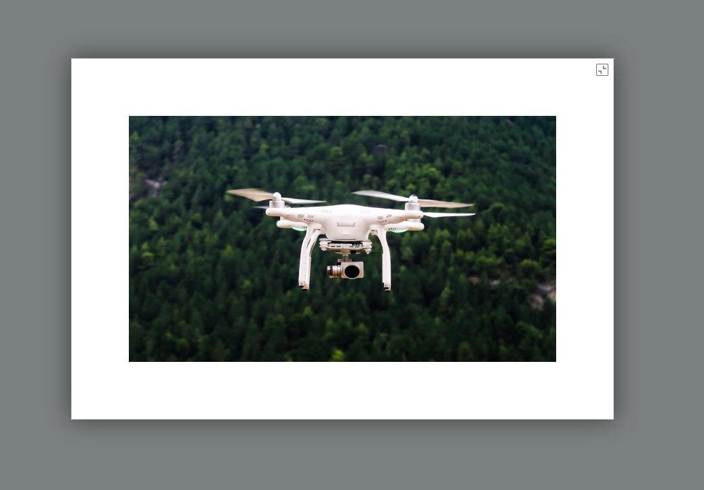

# ptcs-modal-image-popup

## Visual

## Overview

The ptcs-modal-image-popup shows an image thumbnail and a button. Clicking on the button shows the image in a modal pop-up against a semi-opaque backdrop.

## Usage Examples

### Basic Usage

    <ptcs-modal-image-popup src="./some-image.png"></ptcs-modal-image-popup>

    <ptcs-modal-image-popup src="./some-image.png" disabled></ptcs-modal-image-popup>

Attribute `disabled` prevents the pop-up behavior.

## Component API

### Properties
| Property | Type | Description | Triggers a changed event |
|----------|------|-------------|--------------------------|
|src| String | The image to display | No |
|backdropColor| String | The modal dialog backdrop overlay color (default: #232b2d) | No |
|backdropOpacity| String | The modal dialog backdrop opacity, a value between 0 and 1.0 (default: 0.6) | No |
|disabled|Boolean| Is the image pop-up disabled?| No |

### Events

| Name | Description |
|------|-------------|
|popup-close-action| Triggered when clicking on the close button |

### Methods

The component has methods `open` and `close` but they are called automatically from the respective buttons, so do not need to be invoked directly.

| Signature | Description |
|-----------|-------------|
| open() | Opens the modal pop-up dialog. Called when you click on the button in the thumbnail version. |
| close() | Closes the modal pop-up dialog. Called when the close button is clicked. |

## Styling

### Parts

| Part | Description |
|------|-------------|
| popup-root | Container for the modal pop-up |
| popup-link | Container for the link contents |
| image | Container for the thumbnail version of the image |
| disclosure-button | The button that opens the image in the modal pop-up |
| popup-container | The container for the pop-up data across whole browser window |
| popup-contents-and-button | Container for the pop-up itself (the modal dialog and its close button), displayed vertically and horizontally centered in the window |
| popup-contents | Container for the modal pop-up dialog data|
| popup-image | The image in the modal pop-up |
| popup-close-button | The close button in the modal pop-up dialog |

### State attributes

No public state attributes.
