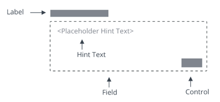

# ptcs-textarea

## Visual

## Overview

&lt;ptcs-textarea&gt; is a multiline input box that can be customized to fit your application.

## Usage Examples

### Basic Usage

~~~html
<ptcs-textarea label="Write a description" hint-text="Add detailed explanation"></ptcs-textarea>
~~~

Shows an text area box with a label and a hint text.

## Component API

### Properties
| Property | Type | Description |  Triggers a changed event? |
|----------|------|-------------|----------------------------|
|counter | Boolean | Adds a characters counter at the end of the field | No |
|disabled | Boolean | If true, the user cannot interact with this element | No |
|hasText | Boolean | read-only property, indicating if text has a non-empty value | No |
|hintText | String | Hint for an empty textarea | No |
|label | String | Label that is shown for the textarea | No |
|labelAlignment | String| Alignment of label (left, right, center). Default: 'left' | No |
|maxNumberOfCharacters | number | Allows only specified amount of characters. Default: 100 | No |
|readOnly | Boolean | This attribute indicates that the user cannot modify the value of the control | No |
|text | String | The initial value of the control. Supports two-way data binding | Yes|
|textAlignment | String| Alignment of text (left, right). Default: 'left' | No |
|tooltip | String | The tooltip that appears when hovering over the text area, or when it has keyboard focus| No |
|tooltipIcon | String | The icon for the tooltip | No |

### Events
| Name | Data | Description |
|------|------|-------------|
| text-changed | { text } | Triggered whenever the value changes |

### Methods

No methods

## Styling

### Parts

| Part | Description |
|-----------|-------------|
|root| The text area parent element|
|label|The label element|
|text-box|The element that wraps value and counter|
|hint-text|The hint text value inside the text-box element|
|text-value|The text value element inside the text-box element|
|counter|The characters counter element inside the text-box element|

###  CSS Variables

Currently no variables are available

### State attributes
|Attribute|Description|Part|
|---------|-----------|----|
| counter | Set to a text field with a characters counter| :host |
| disabled | Set to a disabled text field| :host, text-value |
| hintText | Set hint-text value to be presented on text-box | :host, hint-text |
| readOnly | Set to a read-only (non-editable) text area| :host, text-value |
| label | Set label value | :host, label |
| labelAlignment | Set text alignment in label part | :host, label |
| maxNumberOfCharacters | Set maximum number of characters to be entered in text-value | :host, text-value |
| textAlignment | Set text alignment of text-value input | :host, text-value |
