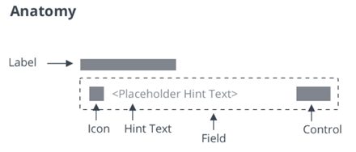

# ptcs-textfield

## Visual

## Overview

&lt;ptcs-textfield&gt; is an input box that can be customized to fit your application.

## Usage Examples

### Basic Usage

~~~html
<ptcs-textfield label="First name" hint-text="Enter first name"></ptcs-textfield>
~~~

Shows an input box with a label and a hint text.

### With validation

~~~html
<ptcs-textfield label="Length in centimeter" mask="numeric" >
</ptcs-textfield>
~~~

Shows an input box that allows only a specific pattern.

### With a search icon

~~~html
<ptcs-textfield icon label="Search Bar" hint="Search">
</ptcs-textfield>
~~~

## Component API

### Properties
| Property | Type | Description |  Triggers a changed event? |
|----------|------|-------------|----------------------------|
|counter | Boolean | Adds a characters counter at the end of the field | No |
|disabled | Boolean | Disables the component | No |
|hasText | Boolean | A read-only property that indicates whether the text has a non-empty value. | No |
|hintText | String | The hint text to show for an empty text field | No |
|icon | String | Specifies the icon with an icon set | No |
|iconSrc | String | Specifies the source location for the left side icon | No |
|label | String | The label that is shown for the text field | No |
|labelAlignment | String | Aligns the label to the right, left, or center. Set to left by default. | No |
|mask | String | Specifies the mask of the following format: a-alpha, 9-numeric, *-alphanumeric | No |
|maxNumberOfCharacters | Number | Allows only specified amount of characters. Default: 100 | No |
|password | Boolean | If true, characters are masked | No |
|readOnly | Boolean | This attribute indicates that the user cannot modify the value of the control | No |
|showClearText | Boolean | Adds a clear-text button at the end of the field | No |
|text | String | The initial value of the control. Supports two-way data binding | Yes |
|textAlignment| String | Sets the text alignment to left or right. Set to left by default. | No |
|tooltip | String | The tooltip that appears when hovering over the text field, or when it has keyboard focus | No |
|tooltipIcon | String | The icon for the tooltip | No |

NOTE: Setting readOnly to true suppresses the text field clear button. Adding the  display-clear-button-on-readonly attribute to ptcs-textfield forces the button to appear despite the text field having this property.

### Events
| Name | Data | Description |
|------|------|-------------|
| text-changed | { text } | Triggered when the text changes |

### Methods

No methods are available

## Styling

### Parts

| Part | Description |
|-----------|-------------|
|root| The text field parent element|
|label | The label element |
|text-box | The element that wraps icon, hint-text, mask, text-value, clear-button, and counter|
|icon | The icon element inside the text-box element |
|mask | The mask element inside the text-box element (underline placeholder) |
|hint-text | The hint text value inside the text-box element |
|text-value | The text value element inside the text-box element |
|clear-button | The clear button inside the text-box element |
|counter | The characters counter element inside the text-box element |

### State attributes
|Attribute|Description|Part|
|---------|-----------|----|
| counter | Set to a text field with a characters counter | :host |
| disabled | Set to a disabled text field | :host, text-value |
| hintText | Set hint-text value to be presented on text-box | :host, hint-text |
| icon | Set a text field with an icon | :host, text-box |
| label | Set label value | :host, label |
| labelAlignment | Set text alignment in label part | :host, label |
| mask | Set a text field with a specified  mask | :host, text-value |
| maxNumberOfCharacters | Set maximum number of characters to be entered in text-value | :host, text-value |
| password | Set to a password mode field|:host, text-value|
| readOnly |  Set to a read-only and non-editable text area| :host, text-value |
| showClearText|Set to a text field with a clear button|:host, clear-button|
| textAlignment | Set text alignment of text-value input | :host, text-value |
